# ML FashionTech

## Fashion industry.

The fashion industry has benefited greatly from AI in the past decades. Helping costumers to choose the size, color, or style, based on their preferences, lifestyle, morphology, etc. In this Notebook, I will show the reader how to train a model, to recognize different clothing items. For this purpose, I will use the MINST public dataset from Zalando Research.

### Zalando Research 

Zalando is one of the biggest fashion sellers in Europe, with a large selection of clothing, accessories, and shoes online. 

Zalando research aims to ease many of the customer problems regarding sizing and type of clothing. They use machine learning and AI to automate these tasks for their customers.

## The MNIST dataset 

 https://research.zalando.com/welcome/mission/research-projects/fashion-mnist/

Mnist Fashion contains 60,000 images for training and 10,000 images to evaluate the precision of a trained model to classify clothes. All images have a dimension of 28 by 28px with 10 types of classes, where we can find coats, T-shirts, slippers, sandals, among others.


```python
# Import the libraries necessary for our simulation

import tensorflow as tf
from tensorflow import keras

from datetime import datetime
import numpy as np
import matplotlib.pyplot as plt

from PIL import Image
import requests
from io import BytesIO

import os
import cv2

# print(tf.__version__)

fashion_mnist = keras.datasets.fashion_mnist


```

## Loading and preparing the training dataset 

The fashion_mnist dataset is integrated in keras, we will declare categories for every different item on it.


```python
(train_images, train_labels), (test_images, test_labels) = fashion_mnist.load_data()

class_names = ['T-shirt', 'Pants', 'Sweater', 'Dress', 'Jacket',
               'flip-flops', 'Shirt', 'Sport shoes', 'Purse', 'Boots']

```

Now, let's take a look at the images, we must remember that every image has a $28px \times 28 px$ dimension, so we will scale the images to a range of $255 px$ and will take a look at one of them.


```python
plt.figure(figsize=(10,10))
for i in range(50):
    plt.subplot(5,10,i+1)
    plt.xticks([])
    plt.yticks([])
    plt.grid(False)
    plt.imshow(train_images[i], cmap=plt.cm.binary)
    plt.xlabel(class_names[train_labels[i]])
    plt.show()
```

|             |             |             |             |            |
| ----------- | ----------- | ----------- | ----------- | ---------- |
| 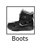   |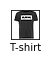     |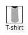   | 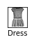    | 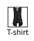   | 
|    |     |   |     |    |
| 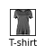  | 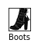  |  |   |  |
| 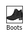  | 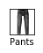  | 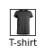 |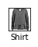  | 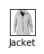 |
| 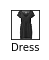  | 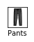 | 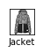 |  | 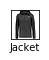 |
|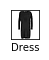   | 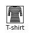  |  | 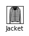 | 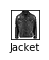 |
|   | 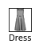 | 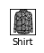 | 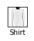 | 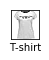 | 
|   |  |  | 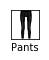 | 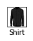 |
| 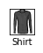  |  | 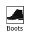 |  | 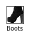 |
|   |  | 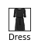 | 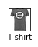 | 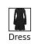 |


```python
train_images = train_images / 255
test_images = test_images / 255

plt.figure()
plt.imshow(test_images[1000], cmap=plt.cm.binary)
plt.colorbar()
plt.grid(False)
plt.show()
```


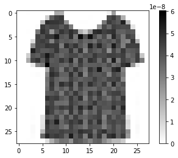


## Initializing the model for our neural network


We will use a simple sequential model, since our CNN will be a linear stack of layers. We will begin by instantiating the Sequential class from Keras. 

Our model must transform the image format from a two-dimensional array of $28 \times 28$ pixels to a one-dimensional array of $28 * 28 pixels = 784$ pixels. Keras will do this for us, trough *keras.layers.Flatten*

Lately, we want to tell our neural network that all layers are fully connected and that the output will be a Softmax layer with 10 nodes, the aim of this layer is to turn arbitrary real values into probabilities, a **probability distribution** defined by:

$$
s (x_i) = \frac{\exp^{x_i}}{\sum_{j=1}^{n} \exp^{x_j}}\quad \quad  \forall \ \{ {x_i} \dots {x_n} \} 
$$

where $s(x_i) \in [0,1]$.


```python
model = keras.Sequential([  keras.layers.Flatten(input_shape=(28,28)), keras.layers.Dense(150, activation=tf.nn.relu),
 keras.layers.Dense(10, activation=tf.nn.softmax) ])
```

# Image recognition

Convolutional Neural Network (CNN), is a class of deep learning networks, originally designed for image analysis. They are made up of neurons that have learnable weights and biases. Each neuron receives some inputs, performs a dot product, and optionally follows it with a non-linearity. CNN's architectures make the explicit assumption that the inputs are images, which allows us to encode certain properties into the architecture. 

In general, Neural Networks utilize the gradient descent optimization algorithm, to reduce the cost function by finding the optimized value for weights. 

Before we can begin training, we need to configure the training process. We decide 3 key factors during the compilation step:


## ADAM optimization algorithm.


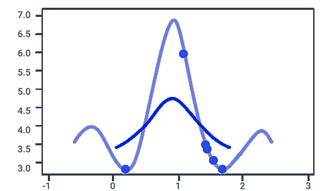

Adaptive Moment Optimization (ADAM), computes adaptive learning rates for each parameter. In addition to storing an exponentially decaying average of past squared gradients $v_t$ like RMSprop, Adam also keeps an exponentially decaying average of past gradients $m_t$, similar to momentum. Whereas momentum can be seen as a ball running down a slope, Adam behaves like a heavy ball with friction, which thus prefers flat minima in the error surface.

$$
m_t = \beta_1 m_{t-1} + (1-\beta_1 )g_t \\
v_t = \beta_2 v_{t-1} + (1-\beta_2 )g_t^2
$$

$m_t$ and $v_t$ are estimates of the first moment (the mean) and the second moment (the non-centered variance) of the gradients respectively, hence the name of the method. We can observe that $m_t$ and $v_t$ are initialized as vectors of $0$'s, so they are biased towards zero, especially during the initial time steps, and especially when the decay rates are small.

To correct the bias we can compute:

$$
\hat{m_t} = \frac{m_t}{ ( 1 - \beta_{1}^{t} ) } 
$$
$$
\hat{v_t} = \frac{v_t}{ ( 1 - \beta_{2}^{t} ) }
$$


So, the ADAM update rule can be written as:

$$
\theta_{t+1} = \theta_{t} - \frac{\eta }{\sqrt{\hat{v}_{t} } + \epsilon} \hat{m}_{t}
$$


- optimizer = ‘adam’: *Adaptive Moment Optimization*, combines the Momentum and Root Mean Square Propagation (RMSProp) methodology, calculating a linear combination between the gradient and the previous increment, and considers the recently appeared gradients in the updates to maintain different learning rates per variable.

- loss = *sparse_categorical_crossentropy*, used to measure the dissimilarity between the distribution of observed class labels and the predicted probabilities of class membership. The cross-entropy loss is defined by 

$$
L ( \theta ) =   \sum_{i=1}^{k} h_{i} \log \hat{ y_{i} }
$$


To do this in our python code, we can call the optimizer algorithm provided in Keras, we can do the next:


```python
## Compiling our model
model.compile(optimizer = 'adam',loss = 'sparse_categorical_crossentropy', metrics=['accuracy'])
```

## model sumary


```python
model.summary()
```

    _________________________________________________________________
    Layer (type)                 Output Shape              Param #   
    =================================================================
    flatten_2 (Flatten)          (None, 784)               0         
    _________________________________________________________________
    dense_4 (Dense)              (None, 150)               117750    
    _________________________________________________________________
    dense_5 (Dense)              (None, 10)                1510      
    =================================================================
    Total params: 119,260
    Trainable params: 119,260
    Non-trainable params: 0
    _________________________________________________________________


# Training


```python
model.fit(train_images, train_labels, epochs=10)
```

    Epoch 1/10
    60000/60000 [==============================] - 4s 63us/sample - loss: 0.4955 - acc: 0.8255
    Epoch 2/10
    60000/60000 [==============================] - 4s 61us/sample - loss: 0.3700 - acc: 0.8670
    Epoch 3/10
    60000/60000 [==============================] - 4s 60us/sample - loss: 0.3318 - acc: 0.8792
    Epoch 4/10
    60000/60000 [==============================] - 4s 60us/sample - loss: 0.3083 - acc: 0.8865
    Epoch 5/10
    60000/60000 [==============================] - 4s 61us/sample - loss: 0.2919 - acc: 0.8927
    Epoch 6/10
    60000/60000 [==============================] - 4s 60us/sample - loss: 0.2761 - acc: 0.8970
    Epoch 7/10
    60000/60000 [==============================] - 4s 60us/sample - loss: 0.2651 - acc: 0.9008
    Epoch 8/10
    60000/60000 [==============================] - 4s 60us/sample - loss: 0.2541 - acc: 0.9037
    Epoch 9/10
    60000/60000 [==============================] - 4s 60us/sample - loss: 0.2449 - acc: 0.9086
    Epoch 10/10
    60000/60000 [==============================] - 4s 61us/sample - loss: 0.2345 - acc: 0.9126


    <tensorflow.python.keras.callbacks.History at 0x7fee3b7f72e8>


```python
test_loss, test_acc = model.evaluate(test_images, test_labels)
print('Test accuracy:', test_acc)
```

    10000/10000 [==============================] - 0s 30us/sample - loss: 0.3375 - acc: 0.8813
    Test accuracy: 0.8813


We pass both the training images and the test images to our training model, 
as well as the number of epochs that for this case we have assigned 10. 
We can see that in each epochs the precision increases and at the end, we have a level of precision of $88.13 \% $

## Saving our model 


```python
target_dir = './model/'
if not os.path.exists(target_dir):
 os.mkdir(target_dir)
model.save('./model/model.h5')
model.save_weights('./model/weights.h5')
model_file = 'model_trained.h5'
tf.keras.models.save_model(model, model_file)
```

It took less than 5 minutes to train the model, but there are cases where the training can take up to weeks, 
so it is a good practice to save our training so that when we want to have them we can instantiate them, instead of doing the training again.

## Predictions... does it work??

Let's see the level of assertiveness that our already trained model gives us, with the test images that we have in our dataset.
We store all the test images in our predictions array.

Remember that we have 10,000 test images in a range from 0 to 9999, so we can change the position of our array. 


```python
predictions = model.predict(test_images)
img_predict = predictions[1000]


print(img_predict)
```

    [2.1411373e-01 4.1174712e-06 5.1588207e-03 3.5855288e-03 3.2909706e-05
     2.2585571e-09 7.7704334e-01 2.8644736e-11 5.3676118e-05 7.9567017e-06]


We maximize the prediction to have the right value of the clothing we used in this test


```python
np.argmax(img_predict)
```


    6


Let's take a look at what item it is, inside our class_names array


```python
print(class_names)
class_names[6]
```

    ['T-shirt', 'Pants', 'Sweater', 'Dress', 'Jacket', 'flip-flops', 'Shirt', 'Sport shoes', 'Purse', 'Boots']


    'Shirt'


```python
index = np.arange(len(class_names))
plt.bar(index, img_predict)
plt.ylabel('Confidence', fontsize=15)
plt.xticks(index, class_names, fontsize=15, rotation=90)
plt.title('Predictions')
plt.show()
```


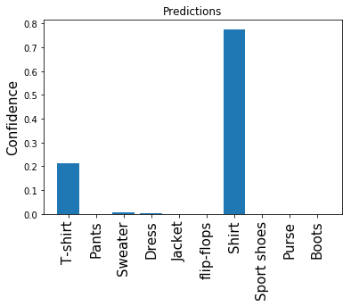


## Verify the result

The model indicates that the selected item corresponds to a Dress. We can check this by showing the image corresponding to that position, taking into account the one we have selected, for this case we are making the prediction in the position.


```python
plt.figure()
plt.imshow(test_images[1000], cmap=plt.cm.binary)
#plt.colorbar()
plt.grid(False)
plt.show()
```


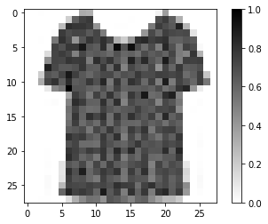


## Conclusion

Keras, is a powerful library, containing built-in classes and functions, that simplifies the development of neural networks and other deep learning applications. Nevertheless, understanding the necessity of those functions, how they work, what operations they perform and the meaning of those operations is strictly necessary.

We had seen the study of a set of images, provided by Zalando research, built a model to detect those images, trained it, and test it, achieving ~ 88% of probability of correct detection.
