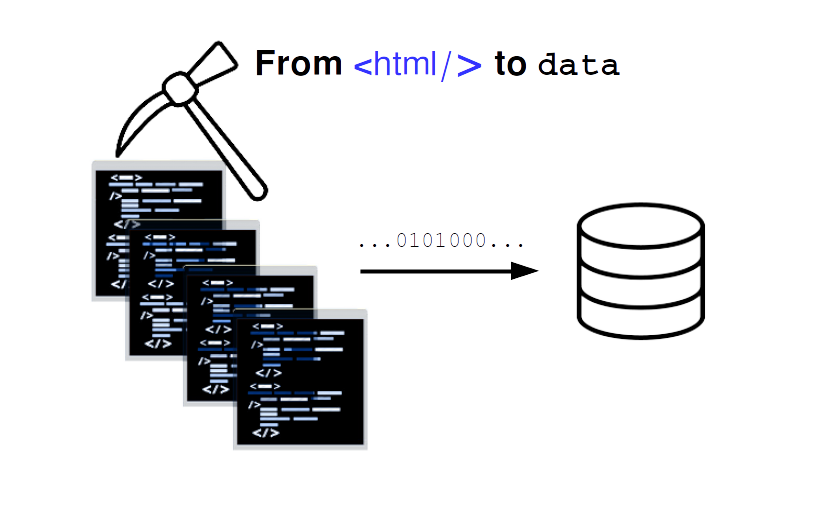
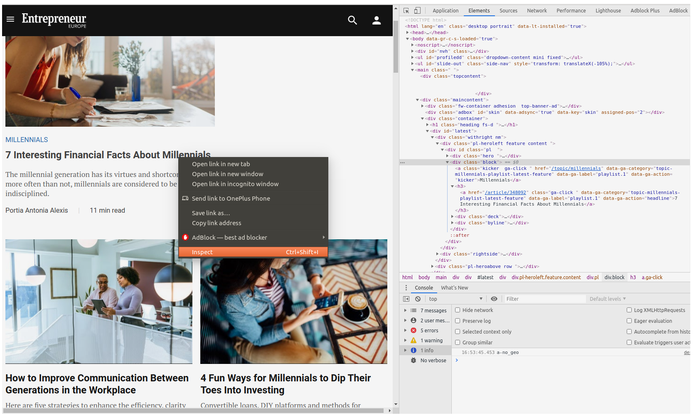
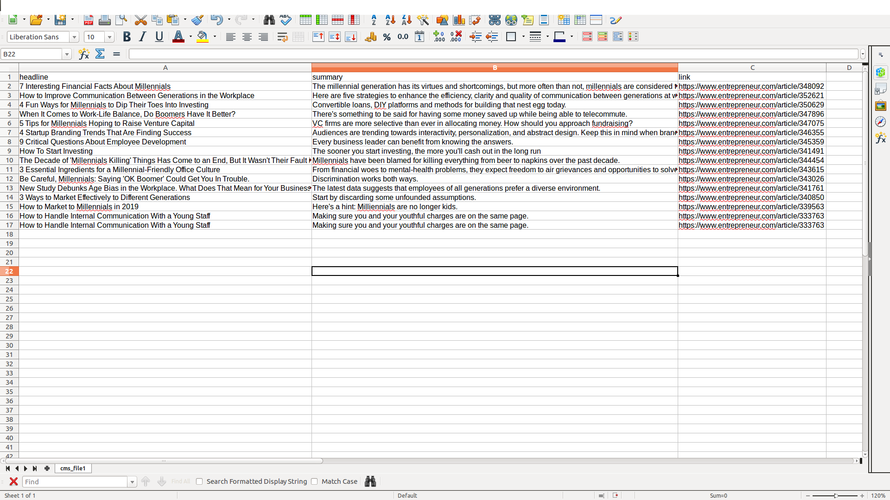

# How to see the big picture?

Web scraping, the answer to get ahead in a world producing billions of data points in seconds.

## What is it?

According to Wikipedia...

<blockquote>
Web scraping, web harvesting, or web data extraction is data scraping used for extracting data from websites. Web scraping software may access the World Wide Web directly using the Hypertext Transfer Protocol or through a web browser. While web scraping can be done manually by a software user, the term typically refers to automated processes implemented using a bot or web crawler. It is a form of copying, in which specific data is gathered and copied from the web, typically into a central local database or spreadsheet, for later retrieval or analysis.
</blockquote>

# In short:

Web scraping, allows you to parse HTML code from websites and save it in a spreadsheet or database giving you data insights.

# Why is it needed ...

Everybody has to take decisions, and making informed decisions is key for any purpose you have. Web scraping allows you to make decisions and understand how other actors in your domain are getting ahead.

- For businesses, this allows them to get the data, information, statistics, or knowledge of the latest trends and understand their competitors.

- For analysts to allow them to get pricing intelligence, competitor analysis, market research, or sentiment analysis, you need to scrape actual data from the web to arrive at a suitable strategy.

# Who needs it

You need this, If you work as:


  - entrepreneur
  - recruiter
  - marketer 
  - researcher
  - analyst
  - journalist 
  - data scientist 
  - medical professional
  - politician
  - lawyer
  - accountant
  


# Let's code.


For web scraping, we will need to install some python libraries like Beautiful Soup, requests and lxml


We need to pull data from websites, for this, we will use a Python library called [Beaitiful Soup](https://www.crummy.com/software/BeautifulSoup/)

  

  


# Install the libraries

## Beautiful Soup
To install [Beaitiful Soup](https://www.crummy.com/software/BeautifulSoup/), only type in your terminal

 - pip install beautifulsoup4
 
This will allow you to get the latest version of the library. Beautiful Soup sits on top of popular Python parsers like lxml and html5lib, allowing you to try out different parsing strategies or trade speed for flexibility. 

## Requests

The [Requests](https://requests.readthedocs.io/en/master/library) library is the standard to make an HTTP request in python. Install the library typing in your terminal:

- pip install requests


## lxml

We will needa “parser” for interpreting the HTML page.  The [lxml](https://lxml.de/) library combines the speed and XML feature completeness of libxml2 and libxslt libraries with the simplicity of a native Python API, mostly compatible but superior to the well-known ElementTree API. Install the library typing in your terminal:

- pip install lxml


# <center> <font size="30"> Example</font> </center>

##   <center> Extracting article information from a blog. </center> 

This example will show you how web scraping is valuable for journalists and business owners. Allowing them to get data from different sources for market analysis.


### Importing our libraries

We need to import our Beautiful Soup (bs4) and requests libraries as follows:


```python
from bs4 import BeautifulSoup
import requests

```

### Now we are going to import an article from the entrepreneur blog on the topic *millennials*

For this, we are going to use the method **GET** from our *requests* library. The GET method indicates that you’re trying to get or retrieve data from a specified resource.

The HTTP request will send us a response 200, this code means the request was valid.


```python
response = requests.get('https://www.entrepreneur.com/topic/millennials')
print(response)

```

    <Response [200]>


### We want to look at the code
Now, we want to make sure that we actually extract the HTML code from the request we made. Besides, we want to see the actual text result of the HTML page, you can read the *.text* property of this object.


```python
source=response.text 
#print(source) 
```

### Now, we can make the Soup

We will make a variable called *soup* that will call the Beautiful soup constructor, this will receive a string. In our case, these will be our source variable, and our *lxml* parser. 

Note, that there are different parsers that we can use for this, but the difference in performance is not that big, feel free to try them all.


```python
soup = BeautifulSoup(source, 'lxml') 
```

### Extracting information about the article

Our *soup* variable contains all the HTML code of the blog, however, we want to extract only what is interesting to us, like the title of the article and the summary. 

To find out what we need to extract, we can go to our web page and open the *developer tools* as follows:
 - *right-click* on the title of an article
 - on the menu, click on *inspect*
 



Once we have localized the HTML tags that contain the information necessary for us, we can extract it with the find function. The information we need is:
 
 - The title 
 - Summary of the article.
 - Link
 - Author
 
The title is contained inside an *a tag*, as well as the *link* URL, the summary is inside *div* with class deck and the author inside a *span* element.

Now, it is important to understand where these elements are wrapped on, so we can see that they are wrapped inside a **div** with class **block**


First, we will begin by extracting the wrapping element. For doing this, we will use the find()  attribute from bs4, that receives the element **div** and the class.

The word **class** is a reserved word in Python, so this function uses **class_** to differentiate between these two. 

Now we can extract a block of code and display it in our terminal, for this we will use the **prettify()** function. A pretty-printed block will allow you to see the indentation of the HTML code, so you can actually notice the tags and elements you need to access.


```python
article = soup.find('div',class_='block')

print(article.prettify())

```

    <div class="block">
     <a class="kicker ga-click" data-ga-action="kicker" data-ga-category="topic-millennials-playlist-latest-feature" data-ga-label="playlist.1" href="/topic/millennials">
      Millennials
     </a>
     <h3>
      <a class="ga-click" data-ga-action="headline" data-ga-category="topic-millennials-playlist-latest-feature" data-ga-label="playlist.1" href="/article/348092">
       7 Interesting Financial Facts About Millennials
      </a>
     </h3>
     <div class="deck">
      The millennial generation has its virtues and shortcomings, but more often than not, millennials are considered to be financially indisciplined.
     </div>
     <div class="byline">
      <a class="ga-click" data-ga-action="authorname" data-ga-category="topic-millennials-playlist-latest-feature" data-ga-label="playlist.1" href="/author/portia-antonia-alexis">
       <span class="name">
        Portia Antonia Alexis
       </span>
      </a>
      <span class="spacer">
       |
      </span>
      <span class="readtime">
       11 min read
      </span>
     </div>
    </div>
    


## Extracting the headline

In our previous line, we notice the title is inside an *$<$a$>$* tag, which is inside an *$<$h3$>$* element

```
<h3>
    <a href="/article/348092">7 Interesting Financial Facts About Millennials </a> 
</h3>
```

We can access the HTML elements, making reference to the object containing the block code, in this case, we called *article*


```python
for article in soup.find_all('div',class_='block'):headline= article.h3.a.text
print(headline)
```


    ---------------------------------------------------------------------------

    AttributeError                            Traceback (most recent call last)

    <ipython-input-13-85011acff508> in <module>
    ----> 1 for article in soup.find_all('div',class_='block'):headline= article.h3.a.text
          2 print(headline)


    AttributeError: 'NoneType' object has no attribute 'a'


## Extracting the summary

The same way, we can extrac the summary, contained inside a *$<$div$>$* element with class name *deck*


```python
sumary = article.find('div',class_='deck' ).text
print(sumary)
```

## Extracting the URL

The URL is an attribute *href* inside the title tag, we can access attributes by specifying it on brackets next to the element where it is contained as follows:


```python
link =  article.h3.a['href']
link = f'https://www.entrepreneur.com{link}'
print(link)
```

 # <center> <font size="30"> Extract  all the articles in a page, save it on a CSV  </font></center> 
  


## The find_all* method

We want to get all articles, we’ll need to use the *find_all()* method to extract all the tags with all the blocks containing an article.

## We need exceptions

Sometimes, a block might have a missing element, url, or a description. So we will use exceptions to pass when something goes wrong.

We will save every article inside a CSV file. Here is the full code of this example.


```python
from bs4 import BeautifulSoup
import requests
import csv

source = requests.get('https://www.entrepreneur.com/topic/millennials').text
domain= 'https://www.entrepreneur.com/'

soup = BeautifulSoup(source, 'lxml') 

with open('cms_file.csv','w') as csv_file:
    csv_writer=csv.writer(csv_file)
    csv_writer.writerow(['headline','summary','link'])

    for article in soup.find_all('div',class_='block'):
        try:
            headline= article.h3.a.text
            #print(headline)

            sumary = article.find('div',class_='deck' ).text
            #print(sumary)

            link =  article.h3.a['href']
            link = f'https://www.entrepreneur.com{link}'
            #print(link)

        except Exception as e:
            pass    


        csv_writer.writerow([headline,sumary,link ])


```

# The resulting CSV file





## Now, try it on financial websites or investment websites, and use pandas to get the most of your data!

